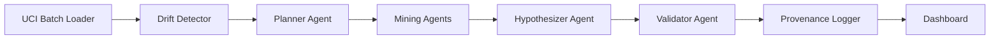

# AADMF Project Summary

AADMF is a streaming, multi-agent drift-mining framework for the UCI Gas Sensor dataset. The system ingests batches, detects drift, selects a mining algorithm, generates hypotheses, validates them, and writes tamper-evident provenance.

## Architecture Overview

### Layer Responsibilities

- **Streaming layer**: loads UCI gas sensor batches from local raw files or `ucimlrepo`.
- **Drift layer**: computes a Page-Hinkley style drift score, now tuned to surface later-batch drift.
- **Planning layer**: chooses the best mining algorithm based on drift, accuracy history, and cost.
- **Mining layer**: runs `StatisticalRules`, `IsolationForest`, `DBSCAN`, or `KMeans` depending on batch conditions.
- **Hypothesis layer**: produces validated sensor-pair statements, optionally phrased by Ollama.
- **Validation layer**: scores and validates hypotheses before they are logged.
- **Provenance layer**: records a hash-chained event log in DictChain or Neo4j.
- **Dashboard layer**: visualizes drift, algorithm selection, hypothesis feed, provenance graph, and tamper demo.

## Key Behaviors

- Drift is visible in later UCI batches instead of staying flat at zero.
- The planner can switch algorithms as drift increases.
- Hypotheses preserve batch context, validation state, and validity rate.
- Provenance remains tamper-evident whether stored locally or in Neo4j.

## Neo4j Deployment Note

Neo4j is optional. If enabled but unavailable, the system now prints a clearer hint to install the Python driver, start Neo4j Desktop or Docker, and verify the Bolt URI before falling back to `DictChainLogger`.

## Recommended Demo Flow

1. Run `python poc.py`.
2. Open `streamlit run aadmf/dashboard/app.py`.
3. Show the drift chart, then the algorithm switches, then the hypothesis feed.
4. Use the tamper demo to show integrity failure after a modification.

## Files To Review First

- `poc.py`
- `config.yaml`
- `aadmf/orchestrator/manual.py`
- `aadmf/orchestrator/langgraph_flow.py`
- `aadmf/dashboard/app.py`
- `aadmf/provenance/neo4j_graph.py`
- `aadmf/llm/ollama_client.py`
